<p align="center">
  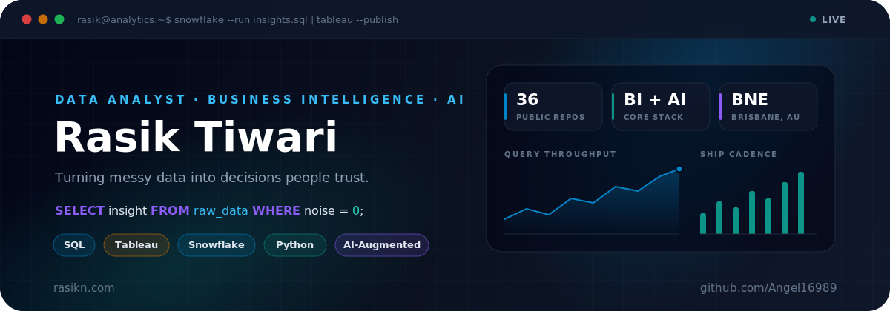
</p>

<p align="center">
  
</p>

<p align="center">
  <a href="https://deviation-pubs-fresh-leaves.trycloudflare.com/"></a>
  <a href="https://rasikn.com"></a>
  <a href="https://liquidlife.rasikn.com"></a>
  <a href="https://www.linkedin.com/in/rasik-tiwari"></a>
  <a href="mailto:rasiktiwari80@gmail.com"></a>
</p>

<p align="center">
  
  
  
  
</p>

---

## 📊 Run the Query

```sql
SELECT  name, role, stack, superpower, mission
FROM    analysts
WHERE   name = 'Rasik Tiwari'
  AND   base = 'Brisbane, AU';

-- ┌────────────┬──────────────────────────────────────────────────────┐
-- │ name       │ Rasik Tiwari                                         │
-- │ role       │ Data Analyst · Business Intelligence · IT Operations │
-- │ stack      │ Snowflake SQL · Tableau · Matillion · Python · Excel │
-- │ superpower │ AI-augmented analytics, end to end                   │
-- │ mission    │ Turn messy data into decisions people trust          │
-- └────────────┴──────────────────────────────────────────────────────┘
-- 1 row returned in 0.02s  ✔
```

I work across **aviation and commercial reporting** — Snowflake SQL investigations, Tableau dashboard validation, discrepancy tracing, Matillion ETL support for budget and forecast datasets — with an IT operations backbone (Microsoft 365, Azure AD, endpoint support). My lane: **turn messy systems, source files, tickets, and dashboards into clean tools people actually use.**

---

## 🔄 How My Data Flows

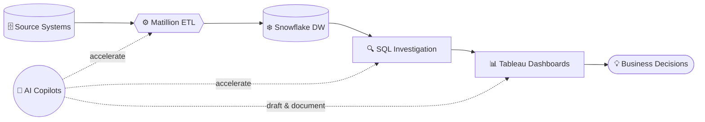

---

## 🧰 The Analytics Arsenal

<table>
  <tr>
    <td align="center" width="50%">
      <h3>🗄️ Data & Warehousing</h3>
      
      
      
    </td>
    <td align="center" width="50%">
      <h3>⚙️ ETL & Automation</h3>
      
      
      
    </td>
  </tr>
  <tr>
    <td align="center">
      <h3>📊 Visualization & BI</h3>
      
      
      
    </td>
    <td align="center">
      <h3>🧑‍💻 Languages</h3>
      
      
      
      
    </td>
  </tr>
  <tr>
    <td align="center">
      <h3>🤖 AI Copilots</h3>
      
      
      
      
    </td>
    <td align="center">
      <h3>☁️ Cloud & Ops</h3>
      
      
      
      
    </td>
  </tr>
</table>

---

## 🤖 AI-Augmented by Default

AI isn't a tool I occasionally reach for — it's wired into how I analyze, build, and ship.

```python
ai_workflow = {
    "analyze":   "Claude + Claude Code — SQL generation, data investigation, agentic builds",
    "prototype": "ChatGPT — rapid exploration, rubber-duck debugging",
    "code":      "GitHub Copilot — inline acceleration, boilerplate elimination",
    "design":    "Google AI Studio + Stitch — UI generation for app builds",
    "principle": "AI drafts. I verify. Data decides.",
}
```

---

## Premier Build

<p align="center">
  <a href="https://deviation-pubs-fresh-leaves.trycloudflare.com/">
    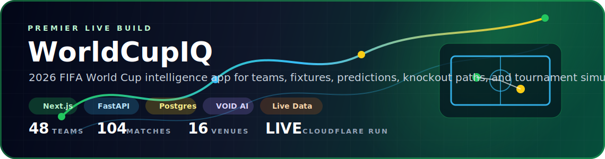
  </a>
</p>

<p align="center">
  <a href="https://github.com/Angel16989/WC26IQ/tree/codex/live-api-warehouse-sync"></a>
  <a href="https://deviation-pubs-fresh-leaves.trycloudflare.com/"></a>
  
</p>

WorldCupIQ is my biggest current build: a live 2026 FIFA World Cup intelligence app with teams, fixtures, predictions, knockout paths, tournament simulation, provider-backed football data, and a separate VOID AI research/runtime layer.

---

## 🚀 Featured Builds

<p align="center">
  <a href="https://github.com/Angel16989/LIQUIDLIFE">
    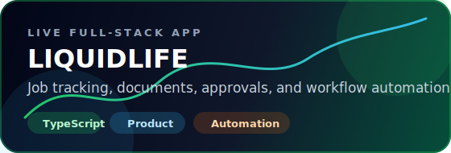
  </a>
  <a href="https://github.com/Angel16989/snowquery">
    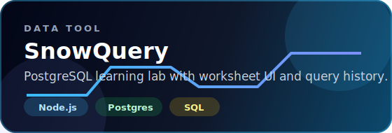
  </a>
</p>

<p align="center">
  <a href="https://github.com/Angel16989/capstone_kent">
    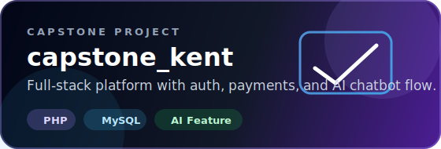
  </a>
  <a href="https://github.com/Angel16989/enterprise-sysadmin-dashboard">
    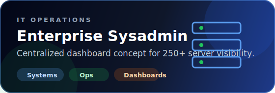
  </a>
</p>

<p align="center">
  <a href="https://github.com/Angel16989/cybersecurity-incident-response">
    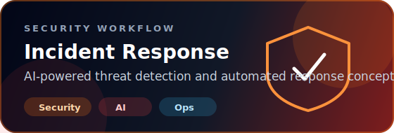
  </a>
  <a href="https://github.com/Angel16989/Password-Expiry-Checker">
    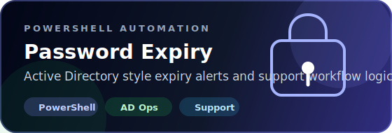
  </a>
</p>

---

## 🗂️ Project Universe

<table>
  <tr>
    <td width="50%">
      <h3>📈 Data, BI & Reporting</h3>
      <a href="https://github.com/Angel16989/WC26IQ/tree/codex/live-api-warehouse-sync"></a><br/>
      <a href="https://github.com/Angel16989/snowquery"></a><br/>
      <a href="https://github.com/Angel16989/domain-device-reports"></a><br/>
      <a href="https://github.com/Angel16989/financial-mini-project"></a><br/>
      <a href="https://github.com/Angel16989/data-structures-algorithms"></a>
    </td>
    <td width="50%">
      <h3>🛠️ IT Ops & Support</h3>
      <a href="https://github.com/Angel16989/enterprise-sysadmin-dashboard"></a><br/>
      <a href="https://github.com/Angel16989/m365-admin-greenlight"></a><br/>
      <a href="https://github.com/Angel16989/endpoint-management-greenlight"></a><br/>
      <a href="https://github.com/Angel16989/it-helpdesk-system"></a>
    </td>
  </tr>
  <tr>
    <td width="50%">
      <h3>🔐 Security & Cloud</h3>
      <a href="https://github.com/Angel16989/cybersecurity-incident-response"></a><br/>
      <a href="https://github.com/Angel16989/ai-ethics-cybersecurity"></a><br/>
      <a href="https://github.com/Angel16989/cloud-computing-project"></a>
    </td>
    <td width="50%">
      <h3>🌐 Web, Product & Apps</h3>
      <a href="https://deviation-pubs-fresh-leaves.trycloudflare.com/"></a><br/>
      <a href="https://liquidlife.rasikn.com"></a><br/>
      <a href="https://github.com/Angel16989/capstone_kent"></a><br/>
      <a href="https://github.com/Angel16989/candyMobileapp"></a><br/>
      <a href="https://github.com/Angel16989/Personal_website_vibecode"></a>
    </td>
  </tr>
</table>

---

## 📇 Analyst Snapshot

<table>
  <tr>
    <td><b>🎯 Current direction</b></td>
    <td>Business Intelligence, data analysis, reporting operations, aviation analytics, and production data quality.</td>
  </tr>
  <tr>
    <td><b>📊 BI toolkit</b></td>
    <td>Snowflake SQL, Tableau, Matillion ETL support, Excel analysis, validation checks, dashboard investigations.</td>
  </tr>
  <tr>
    <td><b>🤖 AI edge</b></td>
    <td>Daily driver of Claude, ChatGPT, and Copilot — AI-assisted SQL, automated reporting checks, agentic project builds.</td>
  </tr>
  <tr>
    <td><b>🛠️ IT foundation</b></td>
    <td>Windows support, Microsoft 365, Azure AD, MFA, device support, ticketing, documentation, stakeholder communication.</td>
  </tr>
  <tr>
    <td><b>🎓 Education</b></td>
    <td>Bachelor of Information Technology, Kent Institute Australia. Capstone included auth, payment workflow, and AI chatbot functionality.</td>
  </tr>
</table>

---

## 📈 GitHub Analytics

<p align="center">
  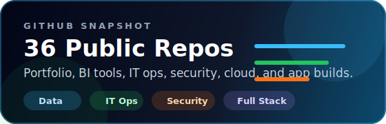
  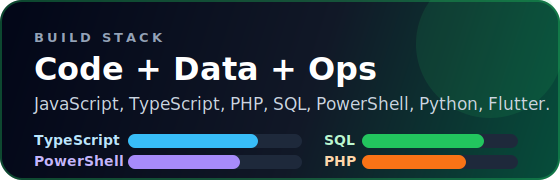
</p>

<p align="center">
  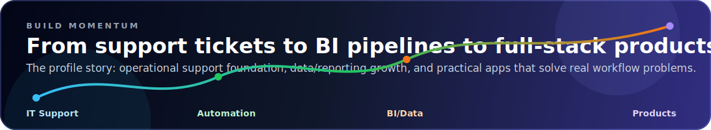
</p>

---

## ⚡ Current Allocation

```text
SQL & data investigation        ████████████░░  87%
Dashboards & data storytelling  ███████████░░░  82%
ETL & reporting pipelines       ██████████░░░░  75%
AI-augmented workflows          █████████████░  93%
Live sports analytics product   ████████████░░  88%
Full-stack product builds       ██████████░░░░  72%
```

> *"Without data, you're just another person with an opinion."* — W. Edwards Deming

---

<p align="center">
  <a href="https://rasikn.com">
    
  </a>
</p>
